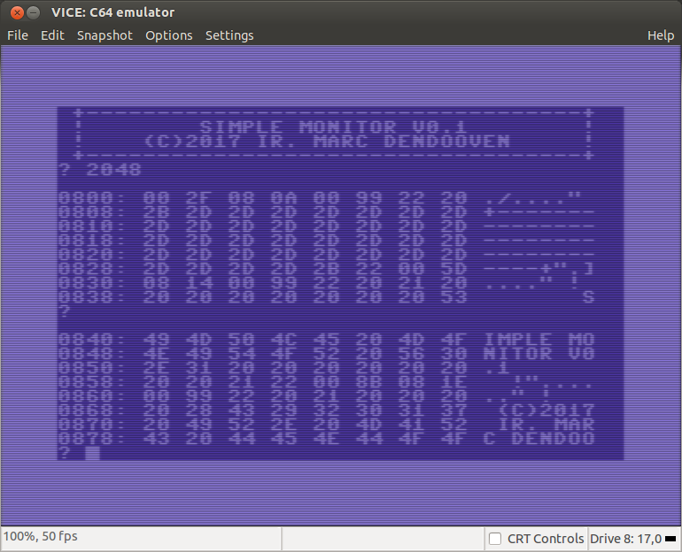

# Simple MONITOR for c64
A monitor let you inspect the memory of the c64.

Enter a (hexadecimal) address after the '?' prompt or just press enter to continue.

Output is a hex dump.

---------
## Version 0.2  
Hex input
---------
## Version 0.1  
Character output for readable characters.
---------
## Version 0.0  
Basic functionality
---------
